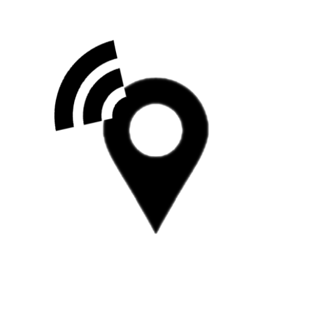
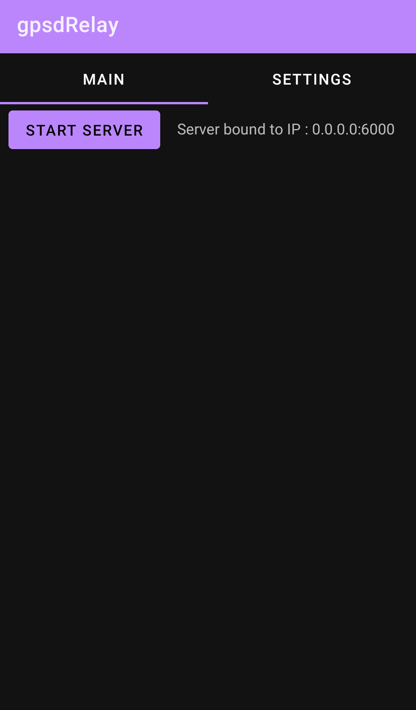

# GPSD Relay

## Description

[Part of the MAW project](https://github.com/project-kaat/maw)

This app utilizes the GPS available on an Android device to supply information to a gpsd server.

The app supports blindly relaying whatever NMEA sentences it reveives from the underlying OS location mechanisms, as well as generating it's own [GPRMC NMEA](https://en.wikipedia.org/wiki/NMEA_0183) sentences using the location data, provided by the OS.

For this to work, the device needs to have a GPS fix available and the gpsd server has to be reachable by the device via IP.

or get it from the [Releases section](https://github.com/project-kaat/gpsdRelay/releases/latest).

### Screenshots

The main tab has a button that starts the relay server.

The settings tab contains all the available preferences.

